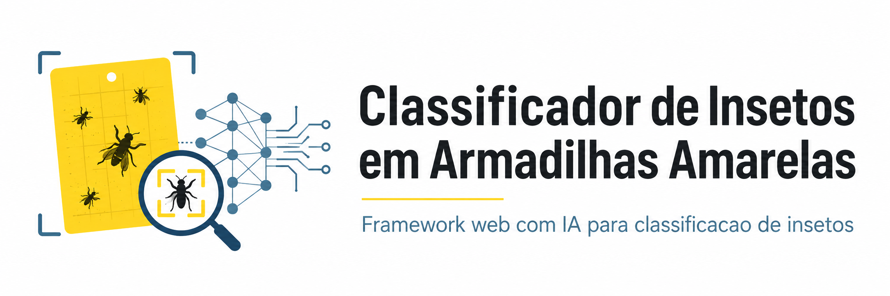

<p align="center">
  
</p>

# Classificador de Insetos em Armadilhas Amarelas

Este repositorio contem um trabalho simples de pos-graduacao que combina uma
aplicacao web com um classificador de imagens. A ideia e receber uma imagem de
inseto ja recortada, extrair caracteristicas visuais com uma ResNet50
pre-treinada, classificar o recorte com KNN e mostrar imagens parecidas da base.

O projeto serve como demonstracao de integracao entre framework web,
processamento de imagens e aprendizado de maquina. Ele nao deve ser tratado como
uma solucao pronta para uso em campo, nao faz diagnostico agronomico e nao
substitui identificacao profissional de pragas.

## O que a aplicacao faz

- Recebe upload de imagens JPG, JPEG, PNG ou WEBP.
- Classifica recortes de insetos em tres classes do dataset.
- Mostra a classe prevista e uma confianca aproximada calculada pelo KNN.
- Exibe as imagens de referencia mais parecidas com o recorte enviado.
- Apresenta uma pagina simples com metricas offline do experimento.

Importante: a aplicacao espera uma imagem de inseto ja recortada. Ela nao detecta
automaticamente insetos em uma foto completa da armadilha.

## Classes usadas

| Sigla | Classe |
| --- | --- |
| MR | Macrolophus pygmaeus |
| NC | Nesidiocoris tenuis |
| WF | Trialeurodes vaporariorum |

## Tecnologias

- Python
- Emmett
- PyTorch e torchvision
- scikit-learn
- Pillow
- matplotlib e seaborn

## Como funciona

O dataset original contem imagens de armadilhas amarelas e anotacoes em XML no
formato PASCAL VOC. O pipeline do projeto usa essas anotacoes para gerar recortes
dos insetos e treinar o classificador.

Fluxo geral:

1. Ler as anotacoes XML do dataset.
2. Recortar os insetos anotados e padronizar cada imagem em 224 x 224 pixels.
3. Usar uma ResNet50 pre-treinada como extrator de caracteristicas.
4. Treinar um KNN com metrica de cosseno sobre os embeddings extraidos.
5. Avaliar o modelo em um conjunto de teste separado por imagem original.
6. Usar os artefatos gerados na aplicacao web.

A separacao por imagem original evita que recortes da mesma foto da armadilha
aparecam ao mesmo tempo no treino e no teste.

## Resultados do experimento

Os resultados abaixo foram gerados a partir dos artefatos e metricas presentes no
repositorio. Eles ajudam a avaliar o comportamento do classificador neste
conjunto de dados, mas nao significam que o sistema esteja validado para uso real
em campo.

- Acuracia: 93,63%
- AUC macro one-vs-rest: 0,9871
- Recortes de treino: 1439
- Recortes de teste: 361
- Imagens originais no treino: 212
- Imagens originais no teste: 52
- Sobreposicao de imagens originais entre treino e teste: 0

As metricas detalhadas ficam em `reports/metrics.json`, e as imagens da matriz de
confusao e da curva ROC ficam em `reports/`.

## Estrutura principal

```text
app.py                  Rotas web e tela de upload
classifier.py           Preparacao da base, extracao de caracteristicas, treino e predicao
scripts/pipeline.py     Comando para preparar, treinar e avaliar
templates/              Telas HTML
static/app.css          Estilos da interface
requirements.txt        Dependencias do projeto
```

O repositorio inclui o dataset original em `yellow-sticky-traps-dataset-main/` e
artefatos treinados em `artifacts/`. Arquivos de ambiente local, cache, uploads e
zips ficam fora do Git.

## Creditos do dataset

O dataset usado neste projeto vem de uma versao com rotulos revisados do Yellow
Sticky Traps Dataset, descrita no README original em
`yellow-sticky-traps-dataset-main/README.md`.

Segundo a documentacao do dataset, essa versao foi criada por Maurice Deserno e
Alexia Briassouli, com ajuda de Carolin Vey, a partir do conjunto original "Raw
data from Yellow Sticky Traps with insects for training of deep learning
Convolutional Neural Network for object detection", publicado por A.T.
Nieuwenhuizen e colaboradores.

Para detalhes completos de autoria, artigo, DOI e fonte dos dados, consulte o
README original do dataset dentro da pasta `yellow-sticky-traps-dataset-main/`.

## Instalar

Crie e ative o ambiente virtual:

```bash
python3 -m venv .venv
source .venv/bin/activate
```

Instale as dependencias:

```bash
pip install -r requirements.txt
```

## Preparar a base, treinar e avaliar

A aplicacao ja vem com artefatos treinados. Se quiser regenerar tudo do zero,
execute:

```bash
python scripts/pipeline.py all
```

Tambem e possivel rodar cada etapa separadamente:

```bash
python scripts/pipeline.py prepare
python scripts/pipeline.py train
python scripts/pipeline.py evaluate
```

As etapas geram:

- `data/crops/`: recortes dos insetos;
- `data/crops_manifest.csv`: manifesto dos recortes;
- `static/reference/`: imagens usadas como exemplos na interface;
- `artifacts/`: modelo KNN, embeddings e metadados;
- `reports/`: metricas e graficos de avaliacao.

## Rodar a aplicacao

Com o ambiente virtual ativo:

```bash
emmett develop
```

Acesse:

```text
http://127.0.0.1:8000
```

Na tela inicial voce pode enviar uma imagem recortada de inseto, usar exemplos da
base e abrir a tela de metricas.

## Problemas comuns

Se a aplicacao avisar que os artefatos nao existem, rode:

```bash
python scripts/pipeline.py all
```

Se o dataset nao for encontrado, confirme que a pasta abaixo esta na raiz do
projeto:

```text
yellow-sticky-traps-dataset-main/
```

Se o comando `emmett develop` nao for encontrado, ative o ambiente virtual e
reinstale as dependencias:

```bash
source .venv/bin/activate
pip install -r requirements.txt
```
